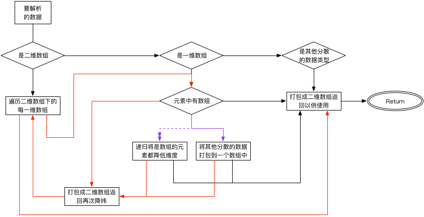

# StepMenu

## 关于多级菜单

这是使用swift实现的一个高可定制性的多级菜单，提供多种方式填充数据源。
菜单中的`Table`默认使用的是`Grouped`模式，所以，对于提供的数据最好都是二维数组的方式，不过没关系，只要你提供的数据在内部都会进行解析以符合使用的要求，所以在理论上来说你可以提供任何类型的数据，都是可以的。

## 类目说明

* `protocol AUUStepMenuDelegate`
多级菜单中的操作通过代理的方式通知使用者，通过代理可以获取到当前选择菜单项、使用自定义的`cell`、设置菜单项的高度、自定义数据类型的数据填充等操作。

* `protocol AUUStepMenuDatasource`
如果添加了这个数据源，那么其下的所有协议方法都需要实现，对于所有菜单项的复用和实现等都交给代理去实现，这样使用的时候就可以像使用`tableview`一样去使用这个多级的菜单

* `class AUUStepMenu`
多级菜单类库，里面保存了使用到的所有私有变量，和提供给外部使用的公开变量、方法等，以及所有自定义的和重载的初始化方法。

* `private extension AUUStepMenu`
里面都是实现多级菜单所需要的私有方法，不向外部公开。

* `extension AUUStepMenu`
关于`UITableView`的所有协议方法都在这里实现。

* `private extension UITableView`
对`tableView`进行的扩充，用于保存相对应的数据。

* `private extension UIView`
对`UIView`进行的扩充，用于方便位置的计算。

## 使用说明

`StepMenu`可以解析提供的数据，进行菜单的数据填充，对于提供的数据来说，在解析的时候，是需要以二维数组的方式来使用的，所以对于将要使用的数据都会进行校验并解析成合法的数据格式。
对于其中的每个元素，可以是`String`、`Dictionary`、`Object`等数据类型。
将数据转换成二维数组如下：



说简单点也就是将二维数组中是数组的元素提取出来，在demo中有几个测试的使用方法，最简单的方法那就是直接添加数据了。
就下面几行代码就能添加一个分级的菜单并接收菜单的选择事件：

```Objective-C
	// 初始化一个测试的数据源
	let testDats = ["A", "b", "c", ["d" : ["e", "f", "g", ["h" : ["i" : ["j" : ["k" : "l"]]]]]], "m", "n", "o", "p", "q", "r", "s", "t", "u"]
    // 添加一个多级菜单
    let stepMenu = AUUStepMenu(frame: CGRect(x: 0, y: 120, width: self.view.bounds.size.width, height:200 ), itemSource: testDats)
    // 接收菜单的选择事件
    stepMenu.selecteCompletion { (menuIndex, itemIndexPath, itemData) in
        print("\(menuIndex), \(itemIndexPath), \(itemData)")
    }
    self.view.addSubview(stepMenu)
```

还有其他的复杂的用法可以看demo。